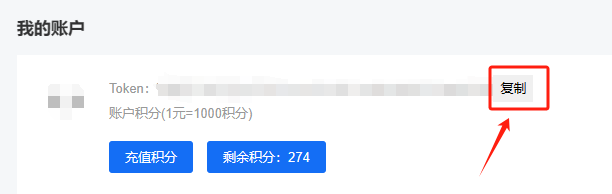
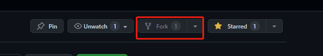
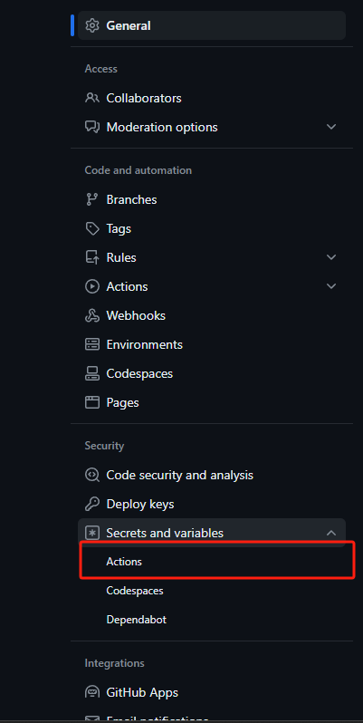
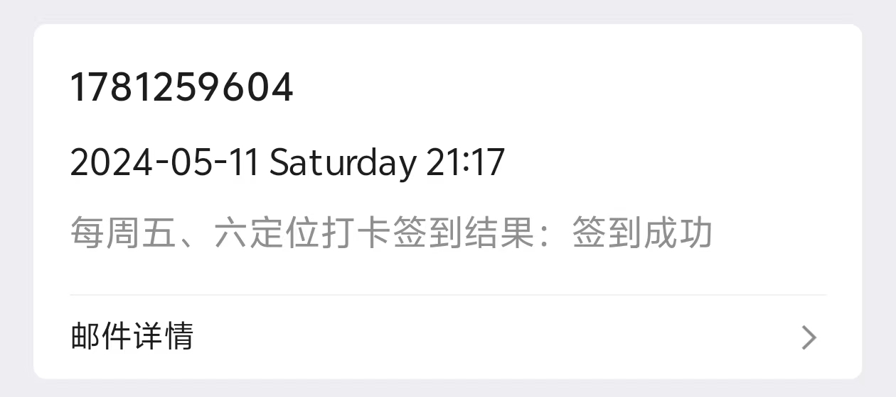
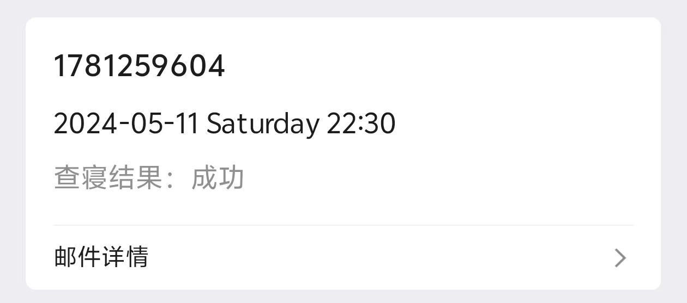

> [doSignIn AND goToBed](#dosignin-and-gotobed)
> 
> [贴吧签到](#贴吧签到)
> 
> [微博超话签到](#微博超话签到)

# doSignIn AND goToBed

    doSignIn是签到
    gotobed是查寝
    定时任务时间要修改在 .github/workflows/doSignIn.yaml 或 gotobed.yaml中修改
    如若使用的是QQ邮箱，第一次请检查是否被当做垃圾邮件，是的话，请将邮件标记为非垃圾邮件

## 变量在仓库的Settings --> Secrets中配置
   [学工平台](https://ids.gzist.edu.cn/lyuapServer/login)

    USERNAME # 上面学工平台的账号
    PASSWORD # 上面学工平台的密码
    EMAIL_ADDRESS # 结果发送邮箱地址
    TOKEN # 打码平台密钥

## 自动打码 注册地址 免费300积分

[云码](https://console.jfbym.com/register/TG66434)

## 具体教程:

1. 先fork仓库
   
2. 在仓库的Settings --> Secrets中配置变量
   
   
3. 配置定时任务

4. 配置成功后，在仓库的Actions中查看运行情况

5. 效果图 

 

# 贴吧签到

1. 先fork仓库
   
2. 在仓库的Settings --> Secrets中配置变量

> BDUSS_BFESS 这两个去网页版登录后在cookie里找
> 
> STOKEN      好像能用挺久的一次

3. 配置定时任务

4. 配置成功后，在仓库的Actions中查看运行情况

# 微博超话签到
   
   自动获取超话列表，自动签到
   使用方法与贴吧签到相同
> SUB_TOKEN 只需要这个cookie，有效期一年

